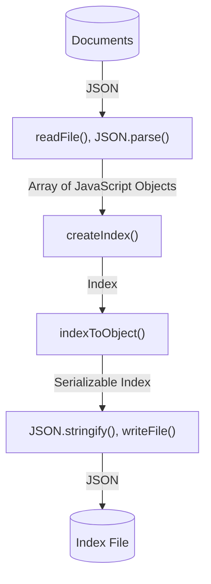
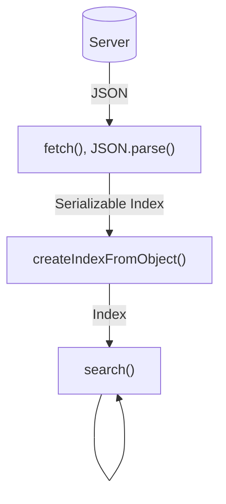

This guide explains the fundamental concepts and workflow of staticseek, from index creation to search execution.

## Overview

staticseek operates through a two-phase process:

1. **Index Creation Phase**: Convert your content into a searchable index
2. **Search Phase**: Query the index to find relevant content

This separation allows you to pre-generate indices during your site's build process, ensuring fast search performance at runtime.

## Index Creation Workflow

The following diagram illustrates the index creation process in a Node.js environment:


### Step 1: Prepare Your Data

staticseek indexes arrays of JavaScript objects. Each object should have consistent fields, though some fields may be optional.
```typescript
const documents = [
    {
        slug: "introduction-to-js",
        content: "JavaScript is a versatile programming language...",
        data: {
            title: "Introduction to JavaScript",
            tags: ["javascript", "web"]
        }
    },
    // More documents...
];
```

### Step 2: Create the Index

Call `createIndex()` with your chosen index type and configuration options:
```typescript
import { LinearIndex, createIndex, StaticSeekError } from "staticseek";

const index = createIndex(LinearIndex, documents, {
    key_fields: ["data.title", "slug"],
    search_targets: ["data.title", "content"]
});

if (index instanceof StaticSeekError) {
    console.error("Index creation failed:", index.message);
    process.exit(1);
}
```

**Configuration Options:**
- `key_fields`: Fields to include in search results (useful for generating links)
- `search_targets`: Fields to index for searching
- `distance`: Default edit distance for fuzzy searches (defaults to 1)
- `weights`: Field-specific weights for relevance scoring

### Step 3: Serialize and Save

Convert the index to a JSON-compatible format and save it:
```typescript
import { indexToObject } from "staticseek";
import { writeFileSync } from "node:fs";

const indexObject = indexToObject(index);
writeFileSync("searchindex.json", JSON.stringify(indexObject));
```

The resulting JSON file can be deployed alongside your static site and fetched by the search interface.

## Search Workflow

The following diagram illustrates the search process in a browser environment:


### Step 1: Load the Index

Fetch and deserialize the index file:
```typescript
import { createIndexFromObject, StaticSeekError } from "staticseek";

const response = await fetch("/searchindex.json");
const indexData = await response.json();

const index = createIndexFromObject(indexData);
if (index instanceof StaticSeekError) {
    console.error("Failed to load index:", index.message);
}
```

### Step 2: Execute Searches

Once loaded, the index can be reused for multiple searches:
```typescript
import { search } from "staticseek";

const results = await search(index, "javascript tutorial");
if (results instanceof StaticSeekError) {
    console.error("Search failed:", results.message);
} else {
    results.forEach(result => {
        console.log(result.key.data.title);
        console.log(result.refs[0].wordaround);
    });
}
```

### Step 3: Process Results

Search results are returned sorted by relevance score. Each result includes:

- `id`: Index of the matching document in the original array
- `key`: Fields specified in `key_fields` during index creation
- `score`: TF-IDF-based relevance score
- `refs`: Array of match locations with surrounding context
```typescript
results.forEach((result, idx) => {
    console.log(`${idx + 1}. ${result.key.data.title}`);
    console.log(`   Score: ${result.score.toFixed(4)}`);
    console.log(`   Context: "${result.refs[0].wordaround}"`);
});
```

## Best Practices

### Index Creation
- Generate indices during your build process (SSG) rather than at runtime
- Choose appropriate `search_targets` to balance search quality and index size
- Use `key_fields` to include only the data needed for displaying results

### Search Implementation
- Load the index once and reuse it for multiple searches
- Implement proper error handling for both index loading and search operations
- Consider using `createSearchFn()` for simplified index loading and search

### Performance Optimization
- Choose the appropriate index type based on your dataset size and search requirements

## Complete Example Programs

### Index Creation Program

The following is a complete example of an index creation program that reads documents from a JSON file and generates a search index:
```typescript
import { LinearIndex, StaticSeekError, createIndex, indexToObject } from "staticseek";
import { readFileSync, writeFileSync } from "node:fs";

if (process.argv.length === 4) {
    const inputFilePath = process.argv[2];
    const outputFilePath = process.argv[3];

    const fileContent = readFileSync(inputFilePath, "utf-8");
    const docs = JSON.parse(fileContent);

    const index = createIndex(LinearIndex, docs, { 
        key_fields: ["data.title", "slug"], 
        search_targets: ["data.title", "content"] 
    });
    
    if (index instanceof StaticSeekError) {
        console.error("Error creating index:", index.message);
        process.exit(1);
    }

    const indexObject = indexToObject(index);
    writeFileSync(outputFilePath, JSON.stringify(indexObject), "utf-8");
    console.log(`Index written to ${outputFilePath}`);
    process.exit(0);
}

console.error("Usage: tsx src/indexing.ts  ");
process.exit(1);
```

**Usage:**
```bash
tsx indexing.ts documents.json searchindex.json
```

### Search Program

The following is a complete example of a search program that loads an index and performs searches:
```typescript
import { readFileSync } from "node:fs";
import { createIndexFromObject, StaticSeekError, search } from "staticseek";
import * as v from "valibot";

if(process.argv.length < 4) {
    console.error("Usage: tsx src/search.ts  ");
    process.exit(1);
}

const indexFilePath = process.argv[2];
const query = process.argv[3];

const indexData = readFileSync(indexFilePath, "utf-8");
const indexObject = JSON.parse(indexData);

const index = createIndexFromObject(indexObject);
if(index instanceof StaticSeekError) {
    console.error("Error loading index:", index.message);
    process.exit(1);
}

const result = await search(index, query);
if(result instanceof StaticSeekError) {
    console.error("Error during search:", result.message);
    process.exit(1);
}

console.log("Search results for query:", query);
if(result.length === 0) {
    console.log("No results found.");
} else {
    const schema = v.object({
        slug: v.string(),
        data: v.object({
            title: v.string(),
        }),
    });
    result.forEach((item, idx) => {
        const key = v.parse(schema, item.key);
        console.log(`${idx + 1}. title: ${key.data.title}, slug: ${key.slug}, from "${item.refs[0].wordaround}"`);
    });
}
```

**Usage:**
```bash
tsx search.ts searchindex.json query_string
```


## Next Steps

- Explore [Index Types](/start-here/index-types) to choose the best option for your needs
- Learn about [Query Syntax](/query/query-syntax) to implement advanced search features
- See [Integration Guides](/start-here/integration) for framework-specific examples
